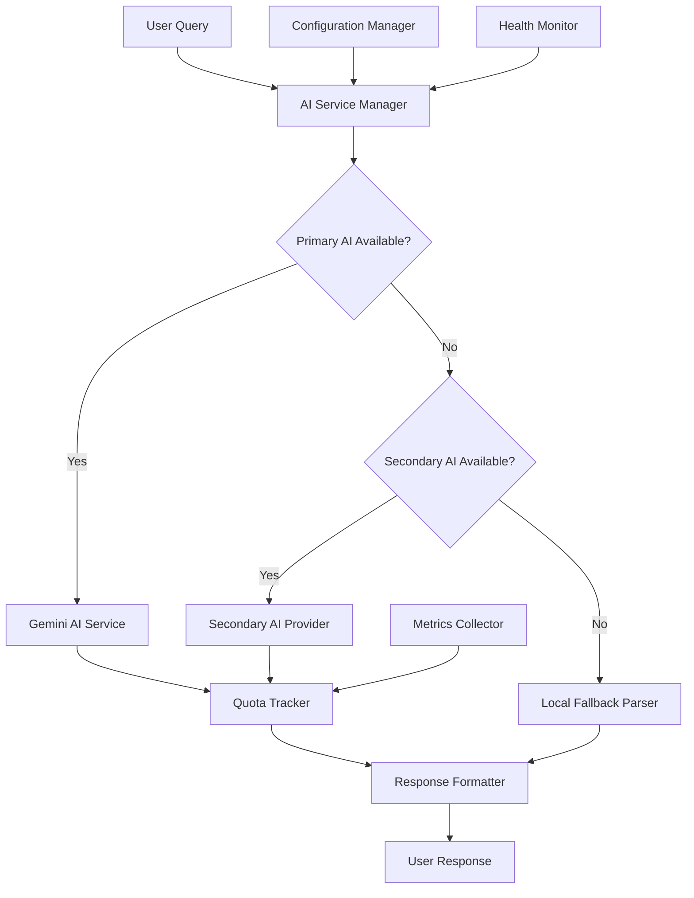
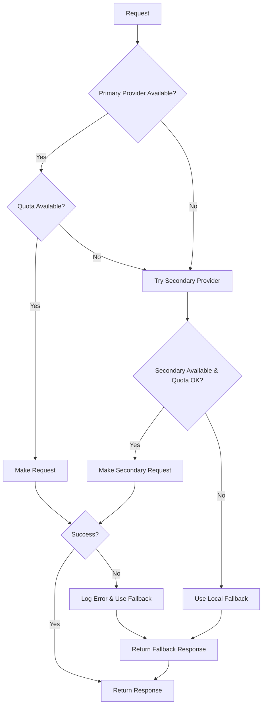

# Design Document

## Overview

This design implements a robust AI quota management system for the phone recommendation service that currently relies on Google Gemini AI. The solution provides multiple layers of fallback mechanisms, quota tracking, and service health monitoring to ensure continuous service availability even when AI services are unavailable or have reached their limits.

The design follows a provider pattern with automatic failover, local fallback parsing, and comprehensive monitoring to maintain service quality while managing costs and quotas effectively.

## Architecture

### High-Level Architecture



### Component Architecture

The system consists of several key components:

1. **AI Service Manager**: Central orchestrator that manages AI provider selection and fallback logic
2. **Quota Tracker**: Monitors usage across all AI providers and enforces limits
3. **Health Monitor**: Continuously checks AI service availability and performance
4. **Local Fallback Parser**: Rule-based query parser for when AI services are unavailable
5. **Configuration Manager**: Handles dynamic configuration of providers and limits
6. **Metrics Collector**: Gathers usage statistics and performance metrics

## Components and Interfaces

### AI Service Manager

```javascript
class AIServiceManager {
  constructor(config, quotaTracker, healthMonitor) {}
  
  async parseQuery(query) {}
  async generateContent(prompt) {}
  getAvailableProviders() {}
  switchToNextProvider() {}
  enableFallbackMode() {}
}
```

**Responsibilities:**
- Manage multiple AI providers in priority order
- Handle automatic failover between providers
- Coordinate with quota tracker before making requests
- Switch to fallback mode when all AI providers are unavailable

### Quota Tracker

```javascript
class QuotaTracker {
  constructor(config) {}
  
  async checkQuota(provider, requestType) {}
  async recordUsage(provider, requestType, tokens) {}
  async getUsageStats(provider) {}
  async resetQuotas() {}
  isQuotaExceeded(provider) {}
}
```

**Responsibilities:**
- Track requests per provider across different time windows (minute, hour, day)
- Enforce quota limits before allowing requests
- Provide usage statistics and warnings
- Handle quota resets based on provider policies

### Health Monitor

```javascript
class HealthMonitor {
  constructor(providers) {}
  
  async checkProviderHealth(provider) {}
  async performHealthChecks() {}
  getProviderStatus(provider) {}
  markProviderUnavailable(provider, reason) {}
  scheduleRecoveryCheck(provider) {}
}
```

**Responsibilities:**
- Continuously monitor AI provider availability
- Implement exponential backoff for failed providers
- Automatically re-enable recovered providers
- Maintain provider status and error history

### Local Fallback Parser

```javascript
class LocalFallbackParser {
  constructor() {}
  
  async parseQuery(query) {}
  extractPriceRange(query) {}
  extractBrandNames(query) {}
  extractFeatureKeywords(query) {}
  buildRecommendationFilters(extractedData) {}
}
```

**Responsibilities:**
- Parse user queries using regex patterns and keyword matching
- Extract price ranges, brand preferences, and feature requirements
- Generate recommendation filters compatible with the existing system
- Provide reasonable defaults when specific criteria aren't found

### Configuration Manager

```javascript
class ConfigurationManager {
  constructor(configPath) {}
  
  loadConfiguration() {}
  updateConfiguration(newConfig) {}
  getProviderConfig(provider) {}
  getQuotaLimits(provider) {}
  validateConfiguration(config) {}
}
```

**Responsibilities:**
- Load and validate configuration from files or environment variables
- Support hot-reloading of configuration changes
- Provide provider-specific settings and quota limits
- Ensure configuration consistency and validation

## Data Models

### Provider Configuration

```javascript
{
  providers: [
    {
      name: "gemini",
      type: "google-generative-ai",
      apiKey: "GOOGLE_API_KEY",
      model: "gemini-2.0-flash",
      priority: 1,
      enabled: true,
      quotas: {
        requestsPerMinute: 60,
        requestsPerHour: 1000,
        requestsPerDay: 200
      },
      retryConfig: {
        maxRetries: 3,
        backoffMultiplier: 2,
        initialDelay: 1000
      }
    },
    {
      name: "openai",
      type: "openai",
      apiKey: "OPENAI_API_KEY",
      model: "gpt-3.5-turbo",
      priority: 2,
      enabled: false,
      quotas: {
        requestsPerMinute: 100,
        requestsPerHour: 2000,
        requestsPerDay: 10000
      }
    }
  ],
  fallback: {
    enabled: true,
    responseDelay: 100
  },
  monitoring: {
    healthCheckInterval: 30000,
    quotaWarningThreshold: 0.8
  }
}
```

### Usage Tracking

```javascript
{
  provider: "gemini",
  timestamp: "2025-08-02T05:28:44.389Z",
  requestType: "parseQuery",
  success: false,
  errorType: "quota_exceeded",
  responseTime: 651,
  tokensUsed: 0,
  quotaStatus: {
    minute: { used: 60, limit: 60 },
    hour: { used: 1000, limit: 1000 },
    day: { used: 200, limit: 200 }
  }
}
```

### Health Status

```javascript
{
  provider: "gemini",
  status: "unavailable",
  lastCheck: "2025-08-02T05:28:44.389Z",
  lastSuccess: "2025-08-02T04:15:22.123Z",
  errorCount: 5,
  nextRetry: "2025-08-02T05:29:44.389Z",
  currentError: {
    type: "quota_exceeded",
    message: "You exceeded your current quota",
    code: 429
  }
}
```

## Error Handling

### Error Classification

1. **Quota Errors (429)**: Automatically switch to next provider or fallback
2. **Authentication Errors (401/403)**: Mark provider as misconfigured, skip to next
3. **Rate Limit Errors (429)**: Implement exponential backoff, temporary disable
4. **Network Errors**: Retry with backoff, mark as temporarily unavailable
5. **Parse Errors**: Log for debugging, return fallback response

### Fallback Strategy



### Recovery Mechanisms

- **Exponential Backoff**: Start with 1s delay, double on each failure, max 5 minutes
- **Circuit Breaker**: After 5 consecutive failures, disable provider for 15 minutes
- **Health Checks**: Test provider recovery every 30 seconds when disabled
- **Graceful Degradation**: Always provide some response, even if lower quality

## Testing Strategy

### Unit Tests

1. **AI Service Manager Tests**
   - Provider selection logic
   - Fallback mechanism triggers
   - Configuration loading and validation
   - Error handling for different scenarios

2. **Quota Tracker Tests**
   - Quota enforcement across time windows
   - Usage recording and statistics
   - Quota reset functionality
   - Warning threshold detection

3. **Local Fallback Parser Tests**
   - Price range extraction from various query formats
   - Brand name detection and normalization
   - Feature keyword matching
   - Filter generation for different query types

4. **Health Monitor Tests**
   - Provider health check logic
   - Exponential backoff implementation
   - Recovery detection and re-enabling
   - Status tracking and reporting

### Integration Tests

1. **End-to-End Query Processing**
   - Test complete flow from query to response
   - Verify fallback activation under different failure scenarios
   - Validate response quality across all modes

2. **Provider Failover Testing**
   - Simulate provider failures and quota exhaustion
   - Verify automatic switching between providers
   - Test recovery when providers become available

3. **Configuration Management**
   - Test hot-reloading of configuration changes
   - Verify provider enable/disable functionality
   - Test quota limit updates

### Load Testing

1. **Quota Limit Testing**
   - Verify quota enforcement under high load
   - Test behavior when approaching limits
   - Validate fallback performance under stress

2. **Concurrent Request Handling**
   - Test thread safety of quota tracking
   - Verify provider selection under concurrent load
   - Test fallback parser performance

### Monitoring and Alerting

1. **Metrics Collection**
   - Request success/failure rates per provider
   - Response times and quota utilization
   - Fallback usage frequency and reasons

2. **Alert Conditions**
   - Provider failure rate exceeds 10%
   - Quota utilization exceeds 80%
   - Fallback mode active for more than 5 minutes
   - Response time degradation beyond thresholds